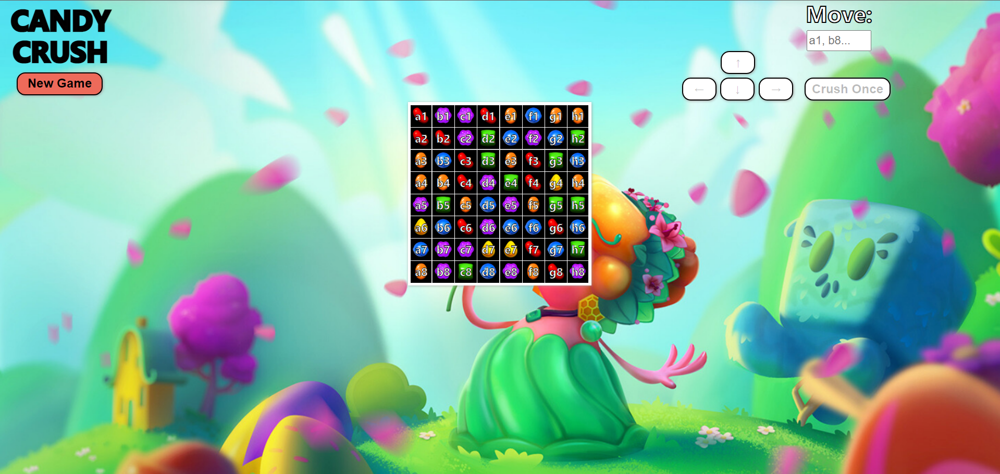
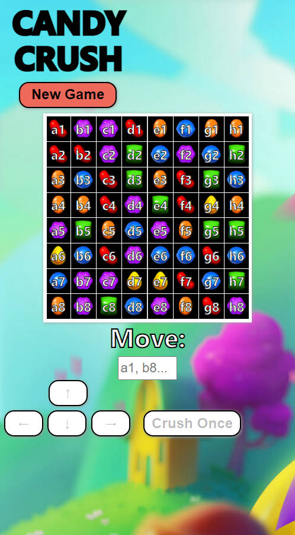

# Candy-Crush [Mobile Friendly]
a simple recreation of Candy Crushing Using HTML/CSS/JAVASCRIPT 

You play by entering a candy id from the table or by clicking on them, and the arrows will light up if you can move there. After moving the candies, you can hit the [crush] button to crush the candies. Hit it repeatedly until there are no more candies to crush left then you go on to move another candy. 
### Demo Pictures: 
#### Desktop -

#### Moblie -

